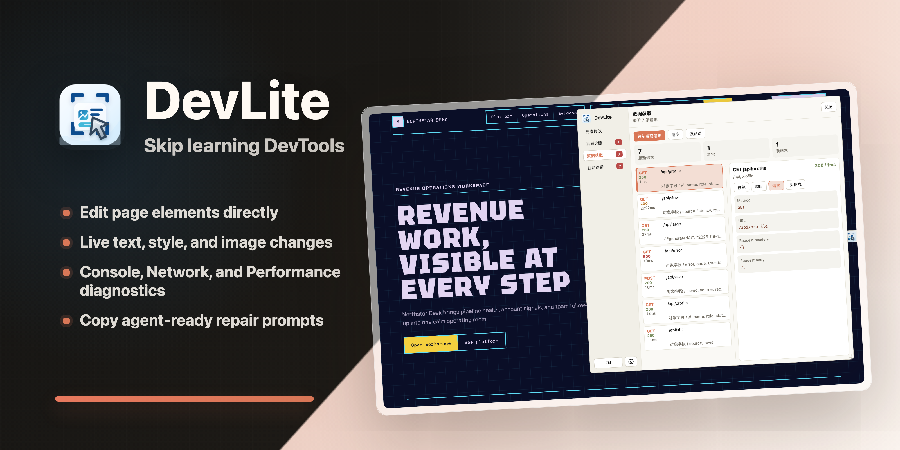

<div align="center">



English | [中文](./README.zh.md)

</div>

---

## Features

| Without DevLite | With DevLite |
| --- | --- |
| Browser DevTools has a high learning cost, making it hard for beginners to get started quickly. | Open the page to inspect elements, review issues, and access diagnostic information. |
| Text, images, and styles cannot be edited directly on the page. | Select page elements and edit them in real time, then preview the result immediately. |
| Design issues can only be communicated to agents through screenshots, which can cause positioning and interpretation gaps. | Automatically collect page elements, edit records, and context, then export a structured prompt that helps agents locate and execute fixes more easily. |
| Logs, network requests, and performance issues are scattered across multiple panels, making clues time-consuming to copy and organize. | View logs, errors, request status, Promise exceptions, and performance metrics in one place, then copy key details in one click. |

---

## Demo

<div align="center">


</div>

---

## Download

<div align="center">

[](https://chromewebstore.google.com/detail/devlite/pppajolpipomdlekjlmboemhoadlkgfm)
&nbsp;&nbsp;

&nbsp;&nbsp;

</div>

---

## Install Companion SKILL to Strengthen Agent Capabilities

DevLite exports prompts compatible with **all mainstream coding agents**:

<div align="center">

[](#)
&nbsp;
[](#)
&nbsp;
[](#)
&nbsp;
[](#)&nbsp;
[](#)

</div>

Strengthen your AI agent's ability to **understand and process DevLite diagnostic reports** by sending this instruction to your agent:

```
Please install the SKILL.md from the https://github.com/JASON-QWeb/DevLite repository into your Agent Skills configuration, and use the browser download links in README.md to help the user install the DevLite browser extension.
```

---

## Developer Setup

```bash
git clone https://github.com/JASON-QWeb/DevLite.git
cd DevLite
npm install
npm run build
```

Then load the `dist/` folder as an unpacked extension in your browser.

---

## Feedback & Contributions

This project is open source under the [Apache License 2.0](./LICENSE). 

If you find it useful, please leave a Star, thanks a lot.

Issues and PRs are welcome.
