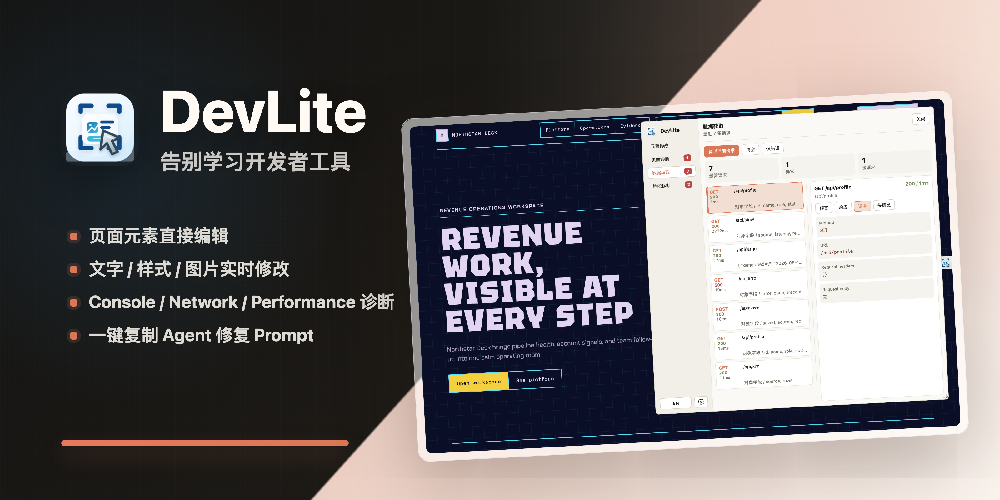

<div align="center">



[English](./README.md) | 中文

</div>

---

## 功能介绍

| 未安装 DevLite | 安装 DevLite 后 |
| --- | --- |
| 浏览器开发者工具学习成本高，新手难快速上手 | 打开页面即可检查元素、查看问题、诊断信息 |
| 无法直接在页面上编辑文字、图片和样式 | 直接选中页面元素实时修改，马上预览修改结果 |
| 只能通过截图与 Agent 沟通设计问题，定位和理解容易出现偏差 | 自动整理页面元素、修改记录和上下文，导出让 Agent 更容易定位、执行的结构化 Prompt。 |
| 日志、网络请求、性能问题分散在多个面板里，复制和整理线索费时费力 | 集中查看日志 、错误、请求状态、Promise 异常和性能指标，一键复制关键内容。 |

---

## 功能演示

<div align="center">


</div>

---

## 下载安装

<div align="center">

[](https://chromewebstore.google.com/detail/devlite/pppajolpipomdlekjlmboemhoadlkgfm)
&nbsp;&nbsp;
[](https://microsoftedge.microsoft.com/addons/detail/devlite/mglelpeocmhnogdgfioljebnonbjdkhj)
&nbsp;&nbsp;
</div>

---

## 安装配套 SKILL

DevLite 导出的 Prompt 支持**全部主流 Coding Agent**：

<div align="center">

&nbsp;&nbsp;&nbsp;&nbsp;
&nbsp;&nbsp;&nbsp;&nbsp;
&nbsp;&nbsp;&nbsp;&nbsp;
&nbsp;&nbsp;&nbsp;&nbsp;
&nbsp;&nbsp;&nbsp;&nbsp;

<br>
&nbsp;&nbsp;&nbsp;&nbsp;
&nbsp;&nbsp;&nbsp;&nbsp;
&nbsp;&nbsp;&nbsp;&nbsp;
&nbsp;&nbsp;&nbsp;&nbsp;
&nbsp;&nbsp;&nbsp;&nbsp;


</div>

发送此指令给你的 Agent，以强化 **处理 DevLite 的能力**：

```
Read https://github.com/JASON-QWeb/DevLite/blob/main/SKILL.md and install the SKILL
```

---

## 开发者启动

```bash
git clone https://github.com/JASON-QWeb/DevLite.git
cd DevLite
npm install
npm run build
```

然后将 `dist/` 文件夹作为未打包的扩展加载到浏览器中。

---

## 反馈与贡献

本项目基于 [Apache License 2.0 许可证](./LICENSE) 开源

觉得好用请留下你的Star，十分感谢

欢迎提交 Issue 反馈问题、提交 PR
